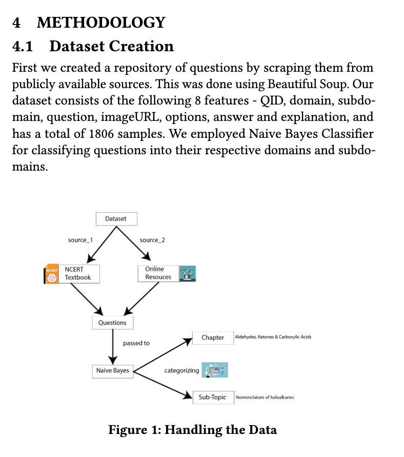

# JEE-T : Automated Practice Paper Generator System for the JEE

## Problem Statement

JEE aspirants waste a lot of time deciding which questions to solve from the vast number of resources they use for preparation. If the questions are not selected carefully, they may not be able to give the weaker areas more attention and repeat questions. It is also challenging and time consuming to find relevant information to learn the concepts used in the question they attempted incorrectly.

## Solution 
We created an adaptive, intelligent practice platform designed to eliminate repetitive question patterns and dynamically target a student's weak areas using Information Retrieval and Machine Learning techniques.


## ⚙️ Methodology & Architecture

### 1. Dataset Creation
* **Scraping:** Built a custom dataset of **1,806 single-correct MCQs and True/False questions** from historical JEE archives using `BeautifulSoup`.
* **Classification Pipeline:** Integrated a Naive Bayes Classifier alongside an Information Retrieval search pipeline (`BM25` and `Cosine Similarity`) utilizing the NCERT textbook corpus to auto-tag scraped questions into their correct subdomains.

  

### 2. Adaptive Tests
* A preliminary diagnostic test evaluates the user's base proficiency across various subdomains.
* **Knowledge Mapping:** Categorizes subdomains into **Easy, Medium, and Hard** based on response correctness and custom response-time thresholds.
* **Dynamic Generation:** Tracks attempted problems via structured data structures to prevent question repetition and dynamically balances domain weights in successive tests based on the student's live knowledge graph.

### 3. Resource Recommendation Engine
* When an incorrect answer is submitted, the platform calculates closeness metrics using a pre-mapped resources database to provide real-time document suggestions.

## 📊 Evaluation & Benchmarking

We benchmarked multiple ranking metrics against a human-supervised ground truth model containing 200 validation samples. **BM25** outperformed other methods and was selected as our primary system ranker.

| Method | MAP | MAR | nDCG |
| :--- | :---: | :---: | :---: |
| **BM25** | **63.07** | **61.88** | **68.23** |
| Cosine Similarity | 56.12 | 49.96 | 63.44 |
| Naive Bayes | 39.97 | 31.45 | 40.20 |


## ⚠️ Limitations & Future Scope
* **Current Scope:** The active evaluation database is currently localized to **Chemistry** and its related subdomains due to initial data collection bandwidth.
* **Future Targets:** Scaling the dataset to fully support Physics and Mathematics, expanding crowd-sourced data channels, and refining cross-subject knowledge graphs.


## 🛠️ Tech Stack Used
* **Frontend/Dashboard:** Streamlit
* **Data Processing & IR:** Beautiful Soup, Scikit-learn (Naive Bayes), BM25, Cosine Similarity
* **Dataset Base:** NCERT Textbooks & Historical JEE Archives


## How to use the app

1. Clone the repo

```
git clone https://github.com/samikshamodi/JEE-T.git
```

2. Go the directory
3. Create a virtual env

```
python -m venv streamlit-env
```

4. Activate virtual env
   - Mac
   ```
   source streamlit-env/bin/activate
   ```

   - Windows
   ```
   streamlit-env\Scripts\activate
   ```
5. Install the requirements

```
pip install requirements.txt
```

6. Run the app

```
streamlit run app.py
```

## Files

1. IRdata2.csv - Dataset File containing features - QID, domain, subdomain, question, imageURL, options, answer and explanation.
2. IRdata_Resource.csv - Dataset file containing relevant resources to study chemistry concepts
3. IRdata_classifier - Dataset containing text from NCERT Chemistry class 12 textbook
4. app.py - code file for our StreamLit Application.
5. question_paper_model.py - code file for our question paper model.
6. userBase.py - code file for user analysis model.
7. difficulty.py - model for deciding difficulty of domain/question.


## 👥 Contributors 
* **Arunim Gupta** 
* **Arshad Abbas Shahabuddin** 
* **Aryan GD Singh** 
* **Samiksha Modi** 
* **Shabeg Singh Gill** 
* **Yash Mathne**
